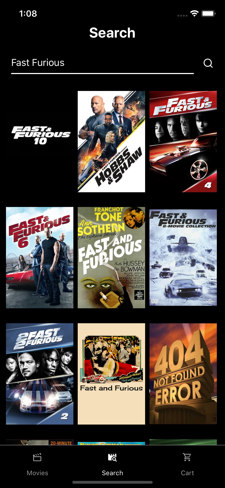

  

# Table of Contents

- [Screenshots](#camera-screenshots)
- [Getting Started](#getting-started)
  - [Requeriments](#requeriments)
    - [Node.js](#nodejs-10142-or-greater)
    - [Yarn](#yarn-optional)
  - [Installation](#installation)
- [APK](#apk)
- [Built With](#built-with)
- [Author](#author)

# :camera: Screenshots

  
  
  
  

# Getting started

## Requeriments

- #### [Node.js](https://nodejs.org) (12.18.3 or greater)
- #### [Yarn](https://yarnpkg.com) (1.22.5 or greater)

Assuming that you've already the [Environment Setup](https://reactnative.dev/docs/environment-setup) for React Native CLI Quickstart

:warning: Create an account on [TMDB](https://www.themoviedb.org) and generate your `API_KEY`!

# Installation

- Clone this repo;
- Navigate to the downloaded folder and then run `yarn` on terminal to install dependencies;
- Rename `env-template.json` to `env.json` and paste your `API_KEY`;
- And finally, run `yarn android` or `yarn ios` on terminal to start the project on your device or simulator.

# APK

- [Download](https://drive.google.com/file/d/1hQjZ_Zh2PLh6Se3VmOsGF1_M63pitxzF/view?usp=sharing)

# Built With

- [React Native](https://reactnative.dev) - A framework for building native apps with React
- [React Redux](https://react-redux.js.org) - Redux is a predictable state container for JavaScript apps
- [React Navigation](https://reactnavigation.org) - Routing and navigation for your React Native apps
- [Axios](https://github.com/axios/axios) - Promise based HTTP client for the browser and node.js
- [React Native Vector Icons](https://github.com/oblador/react-native-vector-icons) - For displaying icons on application

# Author

- 👨🏻‍💻 LinkedIn: [André Angeloni](https://www.linkedin.com/in/andre-angeloni)